#Introduction
In this analysis, I will be analyzing the diamond data from two major online retailers - bluenile.com and brilliantearth.com. I got the inspiration based on my recent shopping experience as well as various analysis that had already been performed by others either using the existing databases or manually scraped data (e.g. https://rstudio-pubs-static.s3.amazonaws.com/94067_d1fdfafd20b14725a2578647031760c2.html).

##Difference between my analysis and other analysis online
This analysis is different from most of the analysis available online because:

* All analysis I found online are performed on either existing R diamonds database or bluenile.com. I am interested in comparing price differences between two retailers rather than one. 
* Besides prices, I am also interested in analyzing whether there is any difference in retail strategy or marketing strategy between two retailers. 

#Overview
This analysis is split into 4 parts:

* Data gathering: gather data from bluenile.com and brilliantearth.com
* Data cleanup: clean up the data and combine two data sources together
* Data analysis: specific analysis performed on the combined data
* Conclusion: key learning points and takeaways

#Loading all packages

```r
library(jsonlite)
library(dplyr)
```

```
## 
## Attaching package: 'dplyr'
```

```
## The following objects are masked from 'package:stats':
## 
##     filter, lag
```

```
## The following objects are masked from 'package:base':
## 
##     intersect, setdiff, setequal, union
```

```r
library(XML)
library(rvest)
```

```
## Loading required package: xml2
```

```
## 
## Attaching package: 'rvest'
```

```
## The following object is masked from 'package:XML':
## 
##     xml
```

```r
library(RCurl)
```

```
## Loading required package: bitops
```

```r
library(knitr)
library(tidyverse)
```

```
## -- Attaching packages --------------------------------------------------------- tidyverse 1.2.1 --
```

```
## v ggplot2 2.2.1     v readr   1.1.1
## v tibble  1.4.1     v purrr   0.2.4
## v tidyr   0.7.2     v stringr 1.2.0
## v ggplot2 2.2.1     v forcats 0.2.0
```

```
## -- Conflicts ------------------------------------------------------------ tidyverse_conflicts() --
## x tidyr::complete()       masks RCurl::complete()
## x dplyr::filter()         masks stats::filter()
## x purrr::flatten()        masks jsonlite::flatten()
## x readr::guess_encoding() masks rvest::guess_encoding()
## x dplyr::lag()            masks stats::lag()
## x purrr::pluck()          masks rvest::pluck()
## x rvest::xml()            masks XML::xml()
```

```r
library(gridExtra)
```

```
## 
## Attaching package: 'gridExtra'
```

```
## The following object is masked from 'package:dplyr':
## 
##     combine
```

```r
load("diamond_analysis.RData")
options(width = 70)
opts_chunk$set(comment = "", warning = FALSE, message = FALSE, echo = TRUE, 
    tidy = TRUE, size = "small")
```
```

\newpage
#Part 1: Data gathering
##Getting data from bluenile.com


```r
# Download data from bluenile.com Below is the url to send a request to
# bluenile.com and receive a json data. As bluenile.com restricts the
# data to 1000 diamonds per request, I create an iteration of request
# using min and max price, with $100 incremental step. As of the day of
# data download, bluenile.com has 120K diamonds for round diamond. So,
# the population downloaded is fairly complete.
bluenileUrl <- "https://www.bluenile.com/api/public/diamond-search-grid/v2?country=USA&language=en-us&currency=USD&startIndex=0&pageSize=1000&shape=RD&sortColumn=price&sortDirection=asc&maxCarat=5"

a = ""
b = ""
for (i in 1:497) {
    a[i] <- 300 + (i - 1) * 100
}
for (i in 1:497) {
    b[i] <- 300 + i * 100
}
# The code below will iterate and pull data from bluenile.com. I
# comment this portion out to avoid downloading the datafrom bluenile
# again accidentally for (i in 1:497){ iterateDownload<-
# fromJSON(paste0(bluenileUrl,'&minPrice=',a[i],'&maxPrice=',b[i]),simplifyDataFrame=TRUE)$results
# bluenileDownload <- rbind(bluenileDownload, bluenileIterateDownload)
# cat(i) }

# 119K of data downloaded
glimpse(bluenileDownload)
```

```
Observations: 119,130
Variables: 25
$ detailsPageUrl   <chr> "./diamond-details/LD00000639", "./diamo...
$ carat            <list> ["0.23", "0.23", "0.30", "0.24", "0.24"...
$ date             <list> ["Jan 29", "Jan 26", "Feb 1", "Feb 1", ...
$ dateSet          <list> ["Jan 30", "Jan 29", "Feb 2", "Feb 2", ...
$ price            <list> ["$510", "$510", "$510", "$510", "$510"...
$ pricePerCarat    <list> ["$2,217", "$2,217", "$1,700", "$2,125"...
$ shipsInDays      <list> ["Call", "Call", "Call", "Call", "Call"...
$ shipsInDaysSet   <list> ["Call", "Call", "Call", "Call", "Call"...
$ skus             <list> ["LD00000639", "LD04351491", "LD0482682...
$ id               <chr> "LD00000639", "LD04351491", "LD04826820"...
$ shapeCode        <list> ["RD", "RD", "RD", "RD", "RD", "RD", "R...
$ shapeName        <list> ["Round", "Round", "Round", "Round", "R...
$ clarity          <list> ["VVS2", "VS1", "SI2", "IF", "IF", "VS1...
$ color            <list> ["F", "D", "G", "G", "G", "I", "G", "G"...
$ culet            <list> ["None", "None", "None", "None", "None"...
$ cut              <list> [<Ideal, Ideal>, <Very Good, Very Good>...
$ depth            <list> ["60.9", "60.5", "62.3", "61.8", "61.9"...
$ fluorescence     <list> ["Faint", "None", "None", "None", "None...
$ lxwRatio         <list> ["1.01", "1.01", "1.00", "1.01", "1.00"...
$ polish           <list> ["Excellent", "Very Good", "Excellent",...
$ symmetry         <list> ["Excellent", "Excellent", "Excellent",...
$ table            <list> ["57.0", "59.0", "56.0", "57.0", "59.0"...
$ hasVisualization <list> [FALSE, FALSE, FALSE, FALSE, FALSE, FAL...
$ measurements     <list> [<3.99 x 3.96 x 2.42 mm, 3.99 x 3.96 x ...
$ myPickSelected   <lgl> FALSE, FALSE, FALSE, FALSE, FALSE, FALSE...
```


##Getting data from brilliantearth.com


```r
# Using simlar concept, I download the data from brilliantearth.com I
# comment most of the codes to avoid sending unnecessary request
brilliantUrl1 <- "https://www.brilliantearth.com/loose-diamonds/list/?shapes=Round&cuts=Fair%2CGood%2CVery+Good%2CIdeal%2CSuper+Ideal&colors=J%2CI%2CH%2CG%2CF%2CE%2CD&clarities=SI2%2CSI1%2CVS2%2CVS1%2CVVS2%2CVVS1%2CIF%2CFL&polishes=Good%2CVery+Good%2CExcellent&symmetries=Good%2CVery+Good%2CExcellent&fluorescences=Very+Strong%2CStrong%2CMedium%2CFaint%2CNone&min_carat=0.25&max_carat=5.00&min_table=45.00&max_table=84.00&min_depth=34.50&max_depth=85.80&min_price=1&max_price=50000&stock_number=&row=0&page="
brilliantUrl2 <- "&requestedDataSize=1000&order_by=price&order_method=asc&currency=%24&has_v360_video=&min_ratio=1.00&max_ratio=2.75&shipping_day=&MIN_PRICE=570&MAX_PRICE=1216420&MIN_CARAT=0.25&MAX_CARAT=25.25&MIN_TABLE=45&MAX_TABLE=84&MIN_DEPTH=34.5&MAX_DEPTH=85.8"

brilliantPage = c(1:22)

# While I iterate through the download, I realize that sometimes the
# column are inconsistent as some data has additional image column.
# Therefore, I first create a single data pull in order to get a sample
# data and all the header name brilliantTempdownload =
# fromJSON(paste0(brilliantUrl1,brilliantPage[1],brilliantUrl2),simplifyDataFrame
# = TRUE)$diamonds

# Then I specify the columns that I want by excluding all columns that
# contain image string.  brilliantDownload <- brilliantTempdownload %>%
# select(-contains('image'))

# I run the iteration to pull the data and use intersect to select only
# the required columns. By doing so, I avoided the errors due to
# inconsistent columns between different iterations. As of the day of
# download, brilliantearth.com has 21308 diamonds, so the population is
# complete.

# for (i in 2:22){ brilliantIterateDownload<-
# fromJSON(paste0(brilliantUrl1,brilliantPage[i],brilliantUrl2),simplifyDataFrame
# = TRUE)$diamonds common_cols<-intersect(colnames(brilliantDownload),
# colnames(brilliantIterateDownload)) brilliantDownload <- rbind(
# subset(brilliantDownload, select=common_cols),
# subset(brilliantIterateDownload, select=common_cols) ) cat(i) }

# 21K rows of data downloaded
glimpse(brilliantDownload)
```

```
Observations: 21,308
Variables: 44
$ origin              <chr> "Botswana Sort", "Botswana Sort", "Bo...
$ symmetry            <chr> "Excellent", "Very Good", "Good", "Go...
$ suggestions         <chr> "2610032A\n0.30 Carat Round Diamond\n...
$ shipping_day        <int> 6, 6, 6, 6, 6, 6, 6, 6, 6, 6, 6, 6, 6...
$ report              <chr> "GIA", "GIA", "GIA", "GIA", "GIA", "G...
$ shape               <chr> "Round", "Round", "Round", "Round", "...
$ length_width_ratio  <dbl> 1, 1, 1, 1, 1, 1, 1, 1, 1, 1, 1, 1, 1...
$ polish              <chr> "Excellent", "Very Good", "Very Good"...
$ clarity             <chr> "SI2", "SI2", "SI1", "SI2", "SI2", "S...
$ id                  <int> 5365785, 5365598, 5366171, 5365543, 5...
$ product_class_exact <chr> "Loose Diamonds", "Loose Diamonds", "...
$ cut                 <chr> "Very Good", "Very Good", "Good", "Ve...
$ orderby_short       <chr> "2 PM PT tomorrow", "2 PM PT tomorrow...
$ title               <chr> "0.30 Carat Round Diamond", "0.30 Car...
$ clarity_order       <int> 1, 1, 2, 1, 1, 1, 1, 1, 2, 1, 1, 2, 1...
$ measurements        <chr> "4.20 x 4.18 x 2.67", "4.24 x 4.20 x ...
$ carat               <dbl> 0.30, 0.30, 0.30, 0.30, 0.32, 0.31, 0...
$ depth               <dbl> 63.8, 63.5, 64.5, 61.6, 62.1, 62.4, 6...
$ color               <chr> "F", "I", "J", "D", "I", "H", "J", "F...
$ valid               <lgl> TRUE, TRUE, TRUE, TRUE, TRUE, TRUE, T...
$ receiveby_short     <chr> "Wed, Feb 21", "Fri, Feb 23", "Fri, F...
$ `_version_`         <dbl> 1.591768e+18, 1.591768e+18, 1.591768e...
$ has_v360_video      <lgl> FALSE, FALSE, FALSE, FALSE, FALSE, FA...
$ title_s             <chr> "0.30 Carat Round Diamond", "0.30 Car...
$ report_order        <int> 4, 4, 4, 4, 4, 4, 4, 4, 4, 4, 4, 4, 4...
$ shipping_supplier   <chr> "KP Sanghvi", "KP Sanghvi", "KP Sangh...
$ price               <int> 500, 500, 530, 530, 530, 530, 540, 55...
$ collection          <chr> "", "", "", "", "", "", "", "", "", "...
$ price_exact         <chr> "500.0", "500.0", "530.0", "530.0", "...
$ culet               <chr> "None", "None", "None", "None", "None...
$ has_cert            <lgl> FALSE, FALSE, FALSE, FALSE, FALSE, FA...
$ active              <lgl> TRUE, TRUE, TRUE, TRUE, TRUE, TRUE, T...
$ table               <dbl> 57, 60, 57, 61, 58, 58, 56, 56, 59, 5...
$ orderby             <chr> "Tuesday February 13, 2018 by 2:00 PM...
$ color_order         <int> 5, 2, 1, 7, 2, 3, 1, 5, 1, 3, 3, 2, 4...
$ fluorescence        <chr> "None", "Strong", "None", "Medium", "...
$ girdle              <chr> "Medium - Thick", "Medium - Thick", "...
$ cut_order           <int> 4, 4, 3, 4, 6, 6, 4, 4, 4, 4, 4, 4, 6...
$ upc                 <chr> "2610032A", "2610410A", "2610463A", "...
$ length              <dbl> 4.190, 4.220, 4.185, 4.245, 4.390, 4....
$ is_memo             <lgl> FALSE, FALSE, FALSE, FALSE, FALSE, FA...
$ receiveby           <chr> "Wednesday, February 21", "Friday, Fe...
$ collection_order    <int> NA, NA, NA, NA, NA, NA, NA, NA, NA, N...
$ v360_src            <chr> NA, NA, NA, NA, NA, NA, NA, NA, NA, N...
```

#Part 2: Data cleaning and combination


```r
# Define the correct format
bluenileTempdata <- bluenileDownload %>% mutate(carat = as.numeric(carat)) %>% 
    mutate(depth = as.numeric(carat)) %>% mutate(table = as.numeric(table)) %>% 
    mutate(price = as.numeric(gsub("[$,]", "", price))) %>% mutate(source = "bluenile")

# as cut is embedded as a list within the data, I have to unlist it and
# parse it back through the temp dataset
bluenileUnlistedcut <- unlist(bluenileTempdata$cut)
odd_indices <- seq(1, 119130, 2)
bluenileTempdata$cut <- bluenileUnlistedcut[odd_indices]

# create a new dataframe for the required columns from Bluenile
bluenileTobemerge <- bluenileTempdata %>% select(price, carat, depth, table, 
    cut, color, clarity, source)

# perform similar clean up for BrilliantEarth
brilliantTobemerge <- brilliantDownload %>% # exclude cut = 'Fair' because bluenile does not have cut='Fair'
filter(cut != "Fair") %>% mutate(source = "brilliant") %>% select(price, 
    carat, depth, table, cut, color, clarity, source)

# combine both dataset and then define the factors for each variable
combineDiamond <- rbind(bluenileTobemerge, brilliantTobemerge) %>% # exclude 'FL' because bluenile has no 'FL'
filter(clarity != "FL") %>% mutate(clarity = factor(clarity, levels = c("IF", 
    "VVS1", "VVS2", "VS1", "VS2", "SI1", "SI2", "I1"))) %>% 
# GIA is an independent gemological institute that grades diamond. In a
# typical diamond grading for cut, there is nothing called 'Astor
# Ideal' or 'Super Ideal', the maximum grading is 'Ideal'. 'Astor
# Ideal' and 'Super Ideal' are recent trend in the diamond industry
# used by some retailers to rebrand their better 'Ideal' cut diamonds
# in order to price discriminate further. I rename 'Astor Ideal' into
# 'Super Ideal' so that the comparison can be performed consistently
# between both retailers.

mutate(cut = gsub("Astor Ideal", "Super Ideal", cut)) %>% mutate(cut = factor(cut, 
    levels = c("Super Ideal", "Ideal", "Very Good", "Good"))) %>% mutate(color = factor(color, 
    levels = c("D", "E", "F", "G", "H", "I", "J"))) %>% mutate(source = factor(source, 
    levels = c("brilliant", "bluenile"))) %>% 
# I always heard that diamonds with exact integer (e.g. 1.00 carat)
# demands greater price. So I create a dummy variable to be used for
# analysis

mutate(caratInteger = carat%%1 == 0)
```

\newpage
#Part 3: Analysis
##Overall data
I first look at the overall dataset by plotting a scatter plot. Here, we can see that diamond price increases with carat in a polynomial manner. We also see that as the features/rarities of the diamonds (i.e. color and clarity) increase, the price also increases. This conforms with the general trend of the diamond prices. However, there doesn't seem to have a distinct pattern for cut. 


```r
ggplot(combineDiamond, aes(x = carat, y = price)) + geom_point(aes(color = factor(color))) + 
    ggtitle("Data distribution by price, carat, color")
```

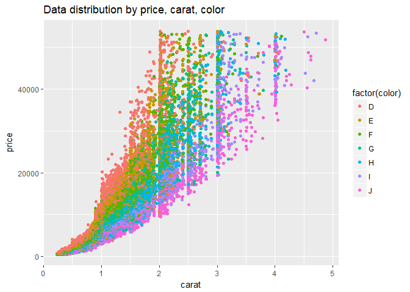<!-- -->

\newpage

```r
ggplot(combineDiamond, aes(x = carat, y = price)) + geom_point(aes(color = factor(clarity))) + 
    ggtitle("Data distribution by price, carat, clarity")
```

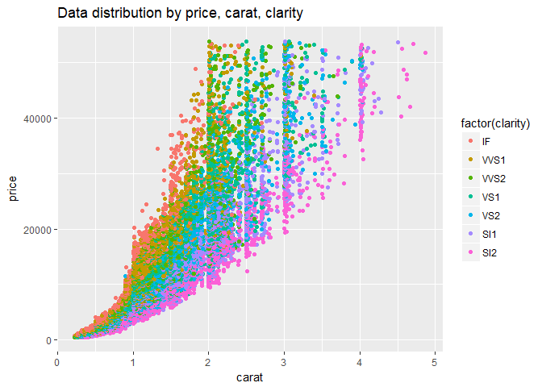<!-- -->

\newpage

```r
ggplot(combineDiamond, aes(x = carat, y = price)) + geom_point(aes(color = factor(cut))) + 
    ggtitle("Data distribution by price, carat, cut")
```

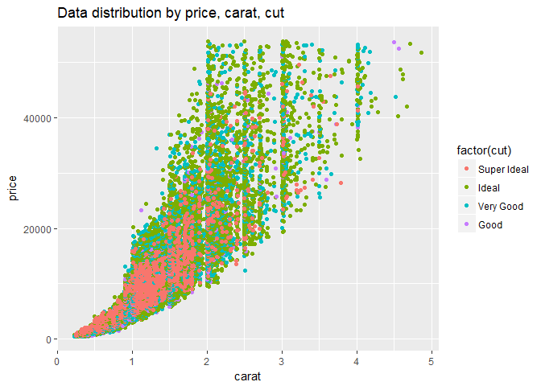<!-- -->

\newpage
##Inventory distribution by carat size
I create a histogram to analyze the inventory distribution by carat. I see that while the inventory size for brilliantearth.com is ~5 times smaller in size as compared to bluenile.com, the inventory distribution is almost similar. For example, there are spikes in inventory for diamonds with carat=1, 1.5, 2. This potentially reflects the consumer's demand for these specific carats. 


```r
ggplot(combineDiamond, aes(x = carat)) + geom_histogram(binwidth = 0.05) + 
    xlim(c(0, 3)) + facet_wrap(~source, scales = "free_y") + ggtitle("Inventory by carat")
```

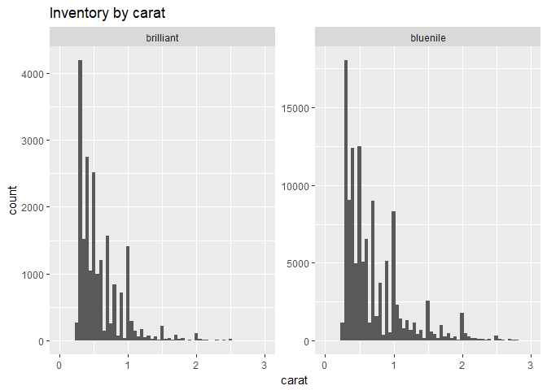<!-- -->

\newpage
##Inventory distribution by color
I then create a similar histogram, but add visualization for distribution of diamond's color. The proportion seems similar.


```r
ggplot(combineDiamond, aes(x = carat)) + geom_histogram(binwidth = 0.05, 
    aes(fill = color)) + xlim(c(0, 3)) + facet_wrap(~source, scales = "free_y") + 
    ggtitle("Inventory by color")
```

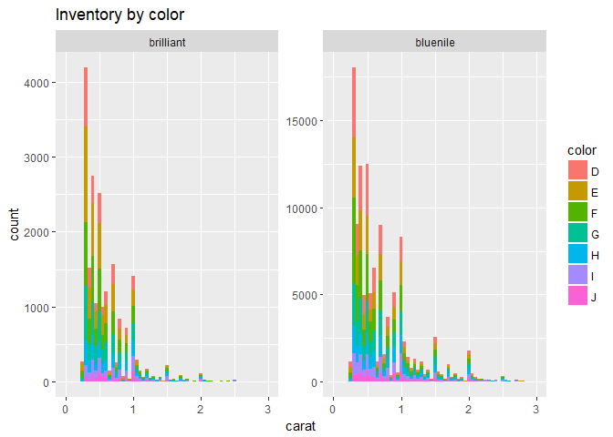<!-- -->

\newpage 
##Inventory distribution by clarity
The distribution of clarity also looks fairly similar.


```r
ggplot(combineDiamond, aes(x = carat)) + geom_histogram(binwidth = 0.05, 
    aes(fill = clarity)) + xlim(c(0, 3)) + facet_wrap(~source, scales = "free_y") + 
    ggtitle("Inventory by clarity")
```

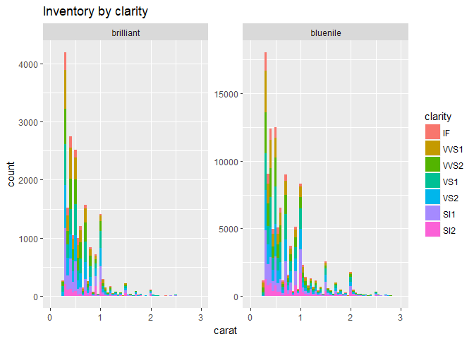<!-- -->

\newpage
##Inventory distribution by cut
When comparing by cut, I realize that there is a significant difference between both retailers. Almost all diamonds at brilliantearth.com are "Super Ideal". As mentioned previously, the highest quality for cut per GIA is "Ideal". However, in recent years, retailers have started to differentiate themselves by selecting better diamonds within the "Ideal" population and marketing them as "Super Ideal" premium grade diamonds (e.g. Bluenile introduces its own "Astor Ideal" in 2017). Naturally, "Super Ideal" demands higher price and generates better margin. Brilliantearth.com could be using this as a key differentiation point to compete with a big retailer like bluenile.com.


```r
ggplot(combineDiamond, aes(x = carat)) + geom_histogram(binwidth = 0.05, 
    aes(fill = cut)) + xlim(c(0, 3)) + facet_wrap(~source, scales = "free_y") + 
    ggtitle("Inventory by cut")
```

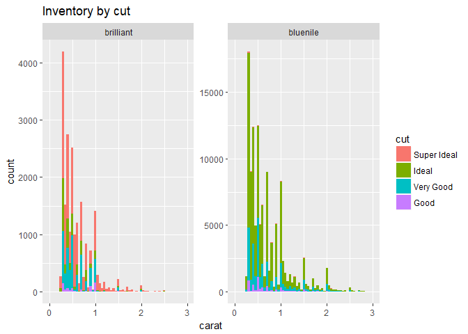<!-- -->

The difference can be highlighted by plotting a 100% stacked chart.


```r
ggplot(combineDiamond, aes(x = carat)) + geom_histogram(binwidth = 0.05, 
    aes(fill = cut), position = "fill") + xlim(c(0, 3)) + facet_wrap(~source, 
    scales = "free_y") + ggtitle("Inventory by cut")
```

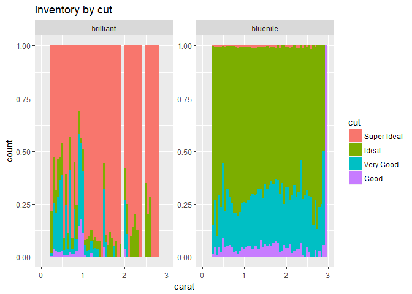<!-- -->

```r
# Table of cut
combineDiamond %>% group_by(cut, source) %>% summarize(N = n()) %>% spread(key = "source", 
    value = N, fill = 0) %>% kable(caption = "Number of diamonds by cut")
```


Table: Number of diamonds by cut

cut            brilliant   bluenile
------------  ----------  ---------
Super Ideal        12133        582
Ideal               3209      85783
Very Good           5137      27262
Good                 708       5224

\newpage
##Comparing price distribution
The next step is to see whether brilliantearth.com prices its diamond higher than bluenile.com. Interestingly, brilliantearth.com's price is very competitive. In fact, it almost never prices higher than bluenile for the same carat. From the initial look, you could get "Super Ideal" cut from brilliantearth.com for the price of "Ideal" cut from bluenile.com, which makes brilliantearth.com sounds more value for money. However, we will need to dig deeper by looking at different combination of 4Cs. 


```r
ggplot(combineDiamond, aes(x = carat, y = price)) + geom_point(aes(color = factor(cut), 
    shape = factor(source))) + ggtitle("Distribution of price")
```

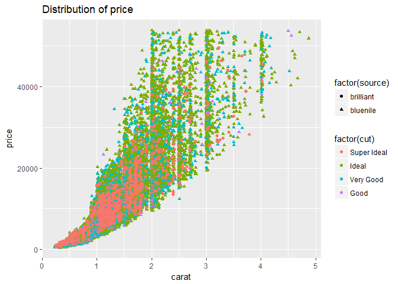<!-- -->

\newpage
In order to do that, I create a box plot and limit the data to cut = "Super Ideal" and "Ideal". Then I look into 4 different scenarios at carat = 0.5, 1.0, 1.5, 2.0. In this case, we see at carats between 0.5 to 1.5, brilliantearth.com has higher average price than bluenile.com while bluenile.com has higher standard deviation. At carat = 2.0, brilliantearth.com has lower average price than bluenile.com.


```r
combineDiamond %>% filter(carat == 0.5 & cut == c("Super Ideal", "Ideal")) %>% 
    ggplot(aes(x = color, y = price)) + geom_boxplot() + coord_flip() + 
    facet_wrap(~source) + geom_jitter(width = 0.12, height = 0, aes(color = clarity)) + 
    ggtitle("Carat = 0.5, cut = Super Ideal & Ideal")
```

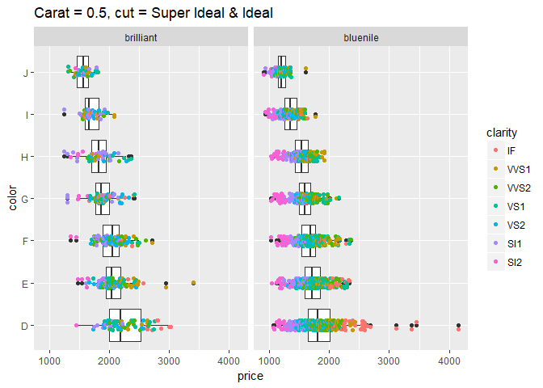<!-- -->
\newpage

```r
combineDiamond %>% filter(carat == 1 & cut == c("Super Ideal", "Ideal")) %>% 
    ggplot(aes(x = color, y = price)) + geom_boxplot() + coord_flip() + 
    facet_wrap(~source) + geom_jitter(width = 0.12, height = 0, aes(color = clarity)) + 
    ggtitle("Carat = 1.0, cut = Super Ideal & Ideal")
```

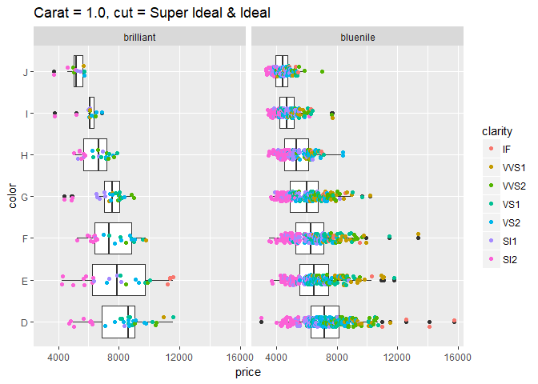<!-- -->
\newpage

```r
combineDiamond %>% filter(carat == 1.5 & cut == c("Super Ideal", "Ideal")) %>% 
    ggplot(aes(x = color, y = price)) + geom_boxplot() + coord_flip() + 
    facet_wrap(~source) + geom_jitter(width = 0.12, height = 0, aes(color = clarity)) + 
    ggtitle("Carat = 1.5, cut = Super Ideal & Ideal")
```

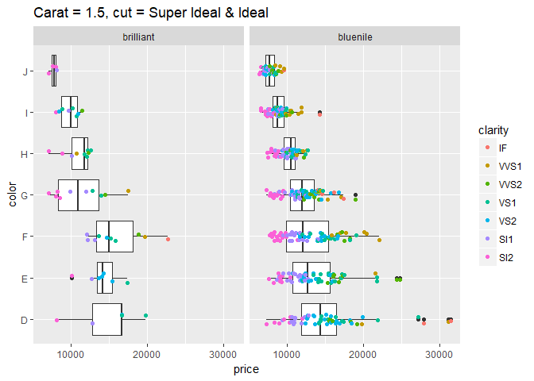<!-- -->
\newpage

```r
combineDiamond %>% filter(carat == 2 & cut == c("Super Ideal", "Ideal")) %>% 
    ggplot(aes(x = color, y = price)) + geom_boxplot() + coord_flip() + 
    facet_wrap(~source) + geom_jitter(width = 0.12, height = 0, aes(color = clarity)) + 
    ggtitle("Carat = 2.0, cut = Super Ideal & Ideal")
```

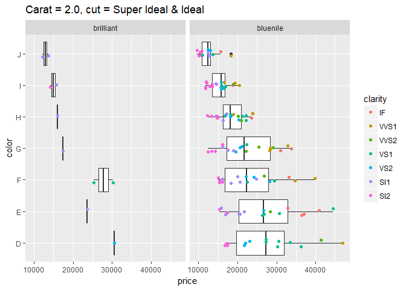<!-- -->

\newpage
##Regression model
Next, I perform a t-test to assess whether there is any pricing difference between two retailers. I create interation variables between carat and other 4Cs to account for the increasing rarity premium. I also create interaction variables between carat and retailers to account for the insights gottem from box plots (i.e. as carat increases, the price difference decreases). Ideally, I should create more interaction variables between each of the 4Cs, due to limited data I have, I decided to keep the regression simple. 

Based on the regression, below are the observations:
* holding all 4Cs constant, brilliantearth.com is 2% more expensive as compared to bluenile.com at carat=1, and the difference narrows down as the carat increases
* holding all 4Cs constant, a diamond with carat = exact integer, is 5% more expensive
* In this case "Super Ideal" diamonds seems to very similar to "Ideal" after combining the effect of cutIdeal and cutIdeal*carat. This could be driven by the skewed population of "Super Ideal" and brilliantearth.com's strategy of pricing "Super Ideal" at "Ideal" price level. We could validate this by rerunning the regression by limiting the population to only brilliantearth.com. The result shows that holding other factors constant, the price difference between "Ideal" and "Super Ideal" is only 0.2%
* As I do not have the data for crown angle to calculate the HCA score, I decided not to include depth and table in the regression. Therefore, there could be omitted variable bias within the regression


```r
regression1 <- lm(formula = I(log10(price)) ~ I(carat^(1/3)) + carat + 
    cut + color + clarity + carat * cut + carat * clarity + carat * color + 
    source + source * carat + caratInteger, data = combineDiamond)
summary(regression1)
```

```

Call:
lm(formula = I(log10(price)) ~ I(carat^(1/3)) + carat + cut + 
    color + clarity + carat * cut + carat * clarity + carat * 
    color + source + source * carat + caratInteger, data = combineDiamond)

Residuals:
     Min       1Q   Median       3Q      Max 
-0.29859 -0.03700 -0.00150  0.03385  0.38120 

Coefficients:
                       Estimate Std. Error  t value Pr(>|t|)    
(Intercept)           0.8399912  0.0028980  289.852  < 2e-16 ***
I(carat^(1/3))        3.3956030  0.0043210  785.845  < 2e-16 ***
carat                -0.2493361  0.0029234  -85.289  < 2e-16 ***
cutIdeal             -0.0190774  0.0014888  -12.814  < 2e-16 ***
cutVery Good         -0.0433704  0.0014941  -29.029  < 2e-16 ***
cutGood              -0.0842615  0.0019719  -42.730  < 2e-16 ***
colorE               -0.0162650  0.0009503  -17.115  < 2e-16 ***
colorF               -0.0198875  0.0009155  -21.723  < 2e-16 ***
colorG               -0.0357759  0.0009743  -36.720  < 2e-16 ***
colorH               -0.0485089  0.0010536  -46.043  < 2e-16 ***
colorI               -0.0965582  0.0011049  -87.392  < 2e-16 ***
colorJ               -0.1494124  0.0013559 -110.191  < 2e-16 ***
clarityVVS1          -0.0202984  0.0014096  -14.400  < 2e-16 ***
clarityVVS2          -0.0363896  0.0013842  -26.290  < 2e-16 ***
clarityVS1           -0.0368929  0.0013580  -27.166  < 2e-16 ***
clarityVS2           -0.0474777  0.0013606  -34.894  < 2e-16 ***
claritySI1           -0.0665329  0.0013506  -49.263  < 2e-16 ***
claritySI2           -0.1535640  0.0015003 -102.353  < 2e-16 ***
sourcebluenile       -0.1275853  0.0012334 -103.444  < 2e-16 ***
caratIntegerTRUE      0.0501033  0.0008493   58.995  < 2e-16 ***
carat:cutIdeal       -0.0170850  0.0020817   -8.207 2.28e-16 ***
carat:cutVery Good   -0.0021353  0.0021004   -1.017    0.309    
carat:cutGood         0.0275293  0.0025706   10.709  < 2e-16 ***
carat:clarityVVS1    -0.0148041  0.0020209   -7.325 2.39e-13 ***
carat:clarityVVS2    -0.0348054  0.0019713  -17.656  < 2e-16 ***
carat:clarityVS1     -0.0560538  0.0018946  -29.586  < 2e-16 ***
carat:clarityVS2     -0.0692726  0.0018971  -36.516  < 2e-16 ***
carat:claritySI1     -0.0992573  0.0018744  -52.955  < 2e-16 ***
carat:claritySI2     -0.0937854  0.0019433  -48.262  < 2e-16 ***
carat:colorE         -0.0100134  0.0012866   -7.783 7.13e-15 ***
carat:colorF         -0.0220897  0.0012383  -17.838  < 2e-16 ***
carat:colorG         -0.0407849  0.0012439  -32.788  < 2e-16 ***
carat:colorH         -0.0609927  0.0012539  -48.641  < 2e-16 ***
carat:colorI         -0.0712321  0.0012623  -56.429  < 2e-16 ***
carat:colorJ         -0.0742989  0.0013976  -53.161  < 2e-16 ***
carat:sourcebluenile  0.1064856  0.0018176   58.585  < 2e-16 ***
---
Signif. codes:  0 '***' 0.001 '**' 0.01 '*' 0.05 '.' 0.1 ' ' 1

Residual standard error: 0.05674 on 140002 degrees of freedom
Multiple R-squared:  0.9831,	Adjusted R-squared:  0.9831 
F-statistic: 2.333e+05 on 35 and 140002 DF,  p-value: < 2.2e-16
```

```r
testreg <- combineDiamond %>% filter(source == "brilliant")

regression2 <- lm(formula = I(log10(price)) ~ I(carat^(1/3)) + carat + 
    cut + color + clarity + carat * cut + carat * clarity + carat * color + 
    caratInteger, data = testreg)
summary(regression2)
```

```

Call:
lm(formula = I(log10(price)) ~ I(carat^(1/3)) + carat + cut + 
    color + clarity + carat * cut + carat * clarity + carat * 
    color + caratInteger, data = testreg)

Residuals:
      Min        1Q    Median        3Q       Max 
-0.285493 -0.031709  0.002444  0.033124  0.240532 

Coefficients:
                    Estimate Std. Error t value Pr(>|t|)    
(Intercept)         1.125028   0.007667 146.733  < 2e-16 ***
I(carat^(1/3))      2.893405   0.011982 241.483  < 2e-16 ***
carat              -0.081701   0.008625  -9.472  < 2e-16 ***
cutIdeal            0.001951   0.001934   1.008  0.31333    
cutVery Good       -0.051610   0.001898 -27.189  < 2e-16 ***
cutGood            -0.100559   0.004482 -22.434  < 2e-16 ***
colorE             -0.020013   0.002481  -8.066 7.64e-16 ***
colorF             -0.027387   0.002448 -11.188  < 2e-16 ***
colorG             -0.035051   0.002565 -13.667  < 2e-16 ***
colorH             -0.049257   0.002780 -17.720  < 2e-16 ***
colorI             -0.084397   0.003143 -26.850  < 2e-16 ***
colorJ             -0.116916   0.003775 -30.971  < 2e-16 ***
clarityVVS1        -0.025248   0.003906  -6.464 1.04e-10 ***
clarityVVS2        -0.034892   0.003876  -9.001  < 2e-16 ***
clarityVS1         -0.028779   0.003796  -7.581 3.56e-14 ***
clarityVS2         -0.029608   0.003786  -7.820 5.55e-15 ***
claritySI1         -0.022370   0.003756  -5.955 2.64e-09 ***
claritySI2         -0.108012   0.004307 -25.078  < 2e-16 ***
caratIntegerTRUE    0.079454   0.002102  37.807  < 2e-16 ***
carat:cutIdeal     -0.032070   0.002978 -10.770  < 2e-16 ***
carat:cutVery Good  0.003641   0.002921   1.246  0.21262    
carat:cutGood       0.013754   0.006051   2.273  0.02304 *  
carat:clarityVVS1  -0.005681   0.006907  -0.823  0.41078    
carat:clarityVVS2  -0.022027   0.006797  -3.241  0.00119 ** 
carat:clarityVS1   -0.042497   0.006625  -6.414 1.44e-10 ***
carat:clarityVS2   -0.058713   0.006594  -8.904  < 2e-16 ***
carat:claritySI1   -0.109960   0.006579 -16.713  < 2e-16 ***
carat:claritySI2   -0.105467   0.006824 -15.456  < 2e-16 ***
carat:colorE        0.004217   0.004102   1.028  0.30395    
carat:colorF       -0.006950   0.003805  -1.827  0.06776 .  
carat:colorG       -0.029147   0.003948  -7.382 1.61e-13 ***
carat:colorH       -0.050818   0.003944 -12.885  < 2e-16 ***
carat:colorI       -0.057857   0.004235 -13.663  < 2e-16 ***
carat:colorJ       -0.074881   0.004603 -16.269  < 2e-16 ***
---
Signif. codes:  0 '***' 0.001 '**' 0.01 '*' 0.05 '.' 0.1 ' ' 1

Residual standard error: 0.05125 on 21153 degrees of freedom
Multiple R-squared:  0.9775,	Adjusted R-squared:  0.9775 
F-statistic: 2.785e+04 on 33 and 21153 DF,  p-value: < 2.2e-16
```


```r
testreg <- combineDiamond %>% filter(source == "brilliant")

regression <- lm(formula = I(log10(price)) ~ I(carat^(1/3)) + carat + cut + 
    color + clarity + carat * cut + carat * clarity + carat * color + caratInteger, 
    data = testreg)
summary(regression)
```

```

Call:
lm(formula = I(log10(price)) ~ I(carat^(1/3)) + carat + cut + 
    color + clarity + carat * cut + carat * clarity + carat * 
    color + caratInteger, data = testreg)

Residuals:
      Min        1Q    Median        3Q       Max 
-0.285493 -0.031709  0.002444  0.033124  0.240532 

Coefficients:
                    Estimate Std. Error t value Pr(>|t|)    
(Intercept)         1.125028   0.007667 146.733  < 2e-16 ***
I(carat^(1/3))      2.893405   0.011982 241.483  < 2e-16 ***
carat              -0.081701   0.008625  -9.472  < 2e-16 ***
cutIdeal            0.001951   0.001934   1.008  0.31333    
cutVery Good       -0.051610   0.001898 -27.189  < 2e-16 ***
cutGood            -0.100559   0.004482 -22.434  < 2e-16 ***
colorE             -0.020013   0.002481  -8.066 7.64e-16 ***
colorF             -0.027387   0.002448 -11.188  < 2e-16 ***
colorG             -0.035051   0.002565 -13.667  < 2e-16 ***
colorH             -0.049257   0.002780 -17.720  < 2e-16 ***
colorI             -0.084397   0.003143 -26.850  < 2e-16 ***
colorJ             -0.116916   0.003775 -30.971  < 2e-16 ***
clarityVVS1        -0.025248   0.003906  -6.464 1.04e-10 ***
clarityVVS2        -0.034892   0.003876  -9.001  < 2e-16 ***
clarityVS1         -0.028779   0.003796  -7.581 3.56e-14 ***
clarityVS2         -0.029608   0.003786  -7.820 5.55e-15 ***
claritySI1         -0.022370   0.003756  -5.955 2.64e-09 ***
claritySI2         -0.108012   0.004307 -25.078  < 2e-16 ***
caratIntegerTRUE    0.079454   0.002102  37.807  < 2e-16 ***
carat:cutIdeal     -0.032070   0.002978 -10.770  < 2e-16 ***
carat:cutVery Good  0.003641   0.002921   1.246  0.21262    
carat:cutGood       0.013754   0.006051   2.273  0.02304 *  
carat:clarityVVS1  -0.005681   0.006907  -0.823  0.41078    
carat:clarityVVS2  -0.022027   0.006797  -3.241  0.00119 ** 
carat:clarityVS1   -0.042497   0.006625  -6.414 1.44e-10 ***
carat:clarityVS2   -0.058713   0.006594  -8.904  < 2e-16 ***
carat:claritySI1   -0.109960   0.006579 -16.713  < 2e-16 ***
carat:claritySI2   -0.105467   0.006824 -15.456  < 2e-16 ***
carat:colorE        0.004217   0.004102   1.028  0.30395    
carat:colorF       -0.006950   0.003805  -1.827  0.06776 .  
carat:colorG       -0.029147   0.003948  -7.382 1.61e-13 ***
carat:colorH       -0.050818   0.003944 -12.885  < 2e-16 ***
carat:colorI       -0.057857   0.004235 -13.663  < 2e-16 ***
carat:colorJ       -0.074881   0.004603 -16.269  < 2e-16 ***
---
Signif. codes:  0 '***' 0.001 '**' 0.01 '*' 0.05 '.' 0.1 ' ' 1

Residual standard error: 0.05125 on 21153 degrees of freedom
Multiple R-squared:  0.9775,	Adjusted R-squared:  0.9775 
F-statistic: 2.785e+04 on 33 and 21153 DF,  p-value: < 2.2e-16
```

#Part 4: Conclusion
Based on the brief analysis above, we observe that both bluenile.com and brilliantearth.com have similar inventory composition by carat as they stock their inventories based on consumer demand. 

It seems that brilliantearth.com attempts to differentiate itself as a high quality retailer by carrying a large pool of "Super Ideal" diamonds, and as a result, it is able to charge a premium over bluenile.com for smaller diamonds. The strategy is apparent from brilliantearth.com's shopping experience, which features much higher resolution picture of the diamonds than bluenile.com.

However, it is unclear whether "Super Ideal" is indeed higher quality than "Ideal" diamond or it is just a pure marketing/branding strategy. If there is indeed a clear quality difference, I would expect to see a clear price difference between "Super Ideal" vs "Ideal" similar to the price differences observed in other 4Cs. 

One way to assess this is by using a patented free online tool (tool url: https://www.pricescope.com/tools/hca) to measure the refraction score of the some sample diamonds. By inputting the table, depth and angle, the tool will return a rating of the diamond based on light physics. Using two examples (Ideal: https://www.brilliantearth.com/loose-diamonds/view_detail/5280275/ vs Super Ideal: https://www.brilliantearth.com/loose-diamonds/view_detail/5354580/) from brilliantearth.com, the "Super Ideal" scores below the "Ideal" diamond. As this is just one data point, I can't conclude whether "Super Ideal" diamond is a more of a marketing/branding strategy. It will be interesting if I could analyze the HCA scores for all diamonds.   

##How can this analysis be improved further
* __More data__: As there are many factors within each 4C and high standard deviation in prices, having more model will provide a more accurate regression.
* __Omitted variable biases__: Omitted variable biases exist in the regression as I did not include all the possible interaction variable and important variables such as table, depth and crown angle. Including them will lead to a more accurate regression.
* __Machine learning algorithm__: One possible ways is to feed the data into a machine learning algorithm and let it predicts the price. However, with this we may not be able to clearly explain the key drivers of price differences. 
